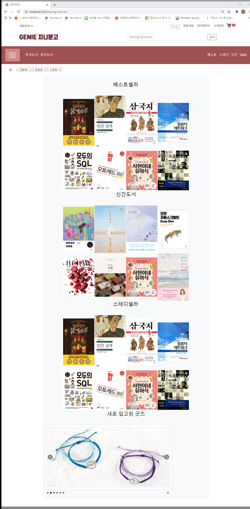
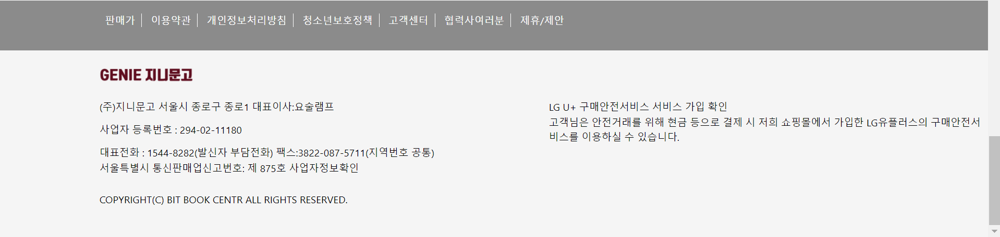
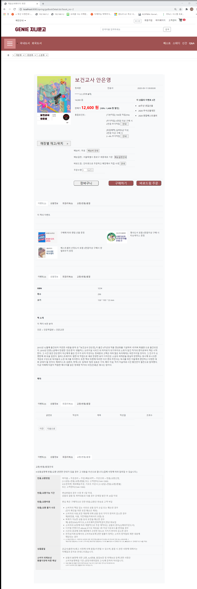
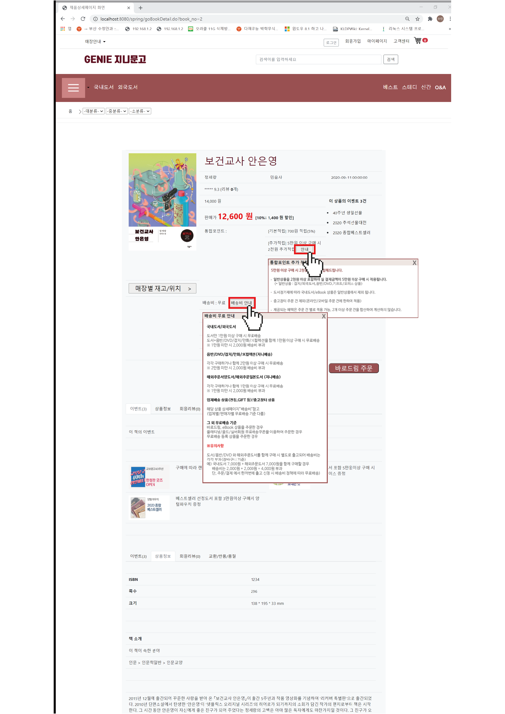
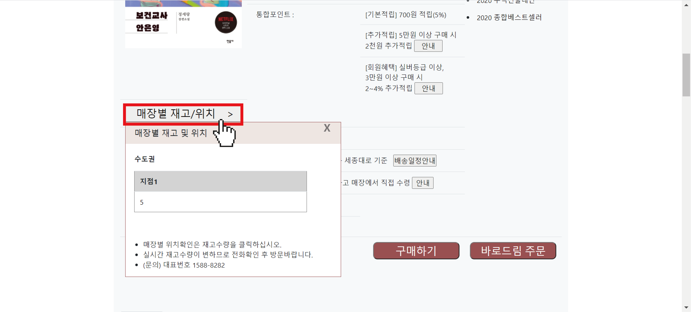
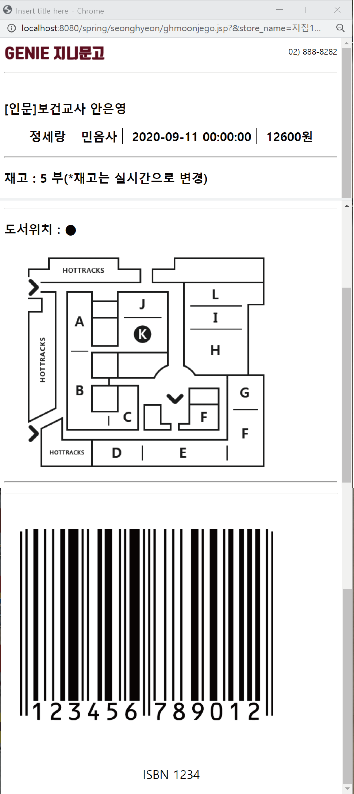

# new

*Genie Bookstore*

파이널 프로젝트로 진행한 지니북스토어 프로젝트 입니다. 교보문고를 모티브로 하여 제작한 이 사이트는 실제 상품의 상세정보를 알고 구매 및 포인트 사용이 가능합니다.
저는 이 프로젝트에서 상품의 상세페이지와 장바구니 부분을 맡았습니다.

[main]
 

[book detail page]
상품의 가격, 재고 등의 상세 정보 및 관련 이벤트 등을 알 수 있는 상품 상세 페이지 입니다. 

관련 버튼을 클릭하여 안내창을 통해 정보를 알 수 있습니다.

매장별 재고/위치 버튼을 클릭하여 상품재고가 있는 매장과 재고갯수를 알 수 있습니다.

앞의 창에서 지점당 보유한 재고갯수를 클릭하여 관련책의 정보와 매장안 책의 위치, 바코드 및 ISBN번호를 알 수 있습니다.

